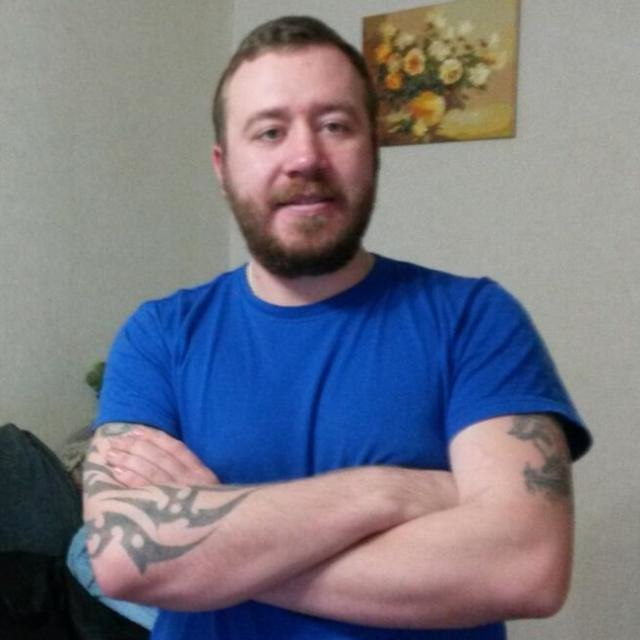

# Иван Скобов

## Python Developer (Junior)  
📍 Самара, Готов к удалёнке  
📧 5secondvano@gmail.com | 📱 +7 917 155 57 70; +7 705 142 95 55 | 💼 [GitHub](https://github.com/IvanSkobov) | 🔗 [Telegram](https://t.me/i5second)

---

### О себе:
• Начинающий Python-разработчик, фокус на backend (Flask/Django/FastAPI).  
• Есть опыт в автоматизации, парсинге, создании телеграм-ботов.  
• Быстро учусь, делаю pet-проекты, ищу команду/фриланс-заказы для роста.

---

### Навыки:
💻 Python (3.x), ООП  
🌐 Flask / Django / FastAPI  
🗄️ SQLite, PostgreSQL, SQLAlchemy  
🤖 Телеграм-боты (aiogram, telebot)  
🔧 Git / GitHub / Docker (базовый)  
📝 HTML, CSS, Bootstrap (базовый frontend)

---

### Опыт / Проекты:

**Проект: Приложения для расчёта зарплаты**  
— Использовал aiogram, SQLite  
— Поддержка команд / inline-кнопок  
— Хранение и статистика расчетов

**Проект: Веб-сайт на Flask с базой данных**  
— Категории и карточки ссылок  
— Добавление/редактирование через веб-интерфейс  
— SQLite, Bootstrap, FullCalendar

**Проект: 2D-игра (Pygame)**  
— Реализованы уровни, коллизии, победа/поражение  
— Чистая архитектура (player.py, level.py, game.py, main.py)

**Парсер вакансий**
— Requests, BeautifulSoup, SQLite, CSV-экспорт

---

### Образование:
**Курсы**: Python-разработчик (ZeroCoder)  
Самостоятельные pet-проекты, GitHub  
**Университет «Синергия»** (Fullstack-разработчик) в процессе обучения.  
**Средне профессиональное образование** (колледж).

---

### Дополнительно:
• Английский: чтение документации.  
• Готовность к стажировке/фрилансу.
